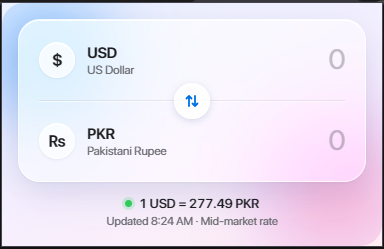
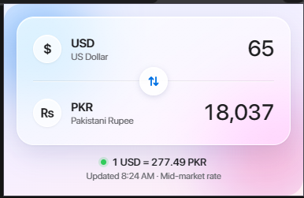

# USD ⇄ PKR

A minimal Chrome extension that converts US Dollars to Pakistani Rupees (and back) as you type. No convert button, no page reloads, just type a number and read the result.

<p align="center">
  
  &nbsp;&nbsp;
  
</p>

## Features

- **Live two-way conversion:** type in either field and the other updates on every keystroke.
- **Swap button:** flip between USD → PKR and PKR → USD. Your last direction is remembered.
- **Live exchange rate:** fetched from a free API and cached for an hour, so the popup opens instantly.
- **Offline fallback:** if you're offline, it uses the last saved rate and shows an amber status dot.
- **Calculator-style input:** the cursor stays hidden, numbers get thousands separators as you type (`200,000,000`), and Backspace clears the whole field in one press.
- **Auto-shrinking numbers:** large amounts scale down so every digit stays visible.
- **Glass UI:** light, frosted-glass design with system fonts (SF Pro on Apple devices, Segoe UI on Windows).

## Installation

The extension isn't on the Chrome Web Store, so you load it manually:

1. Download or clone this repository.
   ```bash
   git clone https://github.com/<your-username>/<repo-name>.git
   ```
2. Open `chrome://extensions` in Chrome (or any Chromium browser such as Brave or Edge).
3. Turn on **Developer mode** in the top right.
4. Click **Load unpacked** and select the project folder (the one containing `manifest.json`).
5. Pin the extension from the puzzle-piece menu in the toolbar.

## Usage

1. Click the extension icon.
2. Type an amount in either field. The other field updates immediately.
3. Press the round arrows button to swap the direction.
4. Press **Backspace** or **Delete** to clear the amount.

## How it works

- Rates come from the [ExchangeRate-API open endpoint](https://open.er-api.com/v6/latest/USD), which needs no API key.
- The rate and the time it was fetched are stored with `chrome.storage.local`. The rate is refreshed when the cached copy is more than one hour old.
- The status dot under the card shows the rate state: green means fresh, amber means the saved rate is being used.
- The rate is the **mid-market rate**. Banks, exchange companies and the open market in Pakistan usually quote a slightly different one, so treat the result as a close estimate, not an exact payout figure.

## Permissions

| Permission | Why it's needed |
| --- | --- |
| `storage` | Saves the cached exchange rate and your last swap direction. |
| `https://open.er-api.com/*` | Fetches the USD → PKR rate. |

The extension collects no personal data and sends nothing except the rate request.

## Project structure

```
.
├── manifest.json     # Extension manifest (Manifest V3)
├── popup.html        # Popup markup
├── popup.css         # Glass UI styles
├── popup.js          # Conversion logic, formatting, rate fetching
├── icons/            # Extension icons (16, 32, 48, 128 px)
└── screenshots/      # Images used in this README
```

## Customization

- **Different currencies:** change the API URL and the `PKR` references in `popup.js`, and update the labels in `popup.html`.
- **Refresh interval:** edit `MAX_AGE` at the top of `popup.js` (default is one hour).

## Credits

Exchange rates by [Exchange Rate API](https://www.exchangerate-api.com).

## License

Add a license of your choice before publishing (for example, [MIT](https://choosealicense.com/licenses/mit/)).
